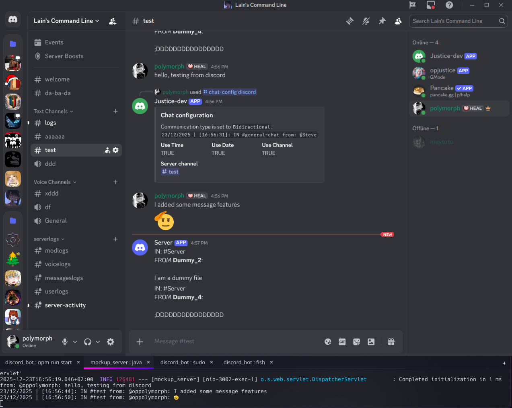

# Hytalecord Chat
Hytalecord Chat is a Hytale mod for servers to connect their Discord and Hytale communities to chat cross-platform.

This repository contains a Discord.js Bot that works with the mod's communication system and a mockup server as proof of concept until Hytale and its APIs are released.

## Installation
### Prerequisite

Technologies can be changed, but not with modifying the source code or the configuration.

- Discord bot: Node.js, NPM, Postgresql
- Mockup Server: Java 25, MVN 3.9+
- Hytale mod: IN WORKING

### Discord bot

Make sure to be inside the directory of the repository
```bash
cd discord_bot/
```

Inside the `discord_bot` directory run:
```bash
npm i
```

### Hytalecord mod - IN WORKING

As the game is not yet released, a mockup Spring boot will be used as a testing tool.

### Mockup server

Uses Spring Boot with mvn
```bash
cd mockup/mockup_server
mvn clean install

# to run on linux and to load .env
export $(xargs < .env) && ./mvnw spring-boot:run
```

## How to use

### Discord bot

#### Environment variables
```bash
BOT_TOKEN=
CLIENT_SECRET=
CLIENT_ID=
OWNER=
HOME_SERVER_ID=

DBPASS=
DBHOST=
DBUSER=
DBPORT=
DBNAME=

ENCRYPT_KEY=
IV=
ALGORITHM=

SERVER_HOST=
SERVER_PORT=

UPSTASH_REDIS_REST_URL=
UPSTASH_REDIS_REST_TOKEN=
RATE_LIMIT_COUNT = 
RATE_LIMIT_TIME = 
```
#### NPM commands
Navigating inside `discord_bot/` the following NPM commands are provided from package.json
```bash
npm run build # runs tsc to build the javascript sources
npm run start # runs "node -r dotenv/config ./dist/justice.js" to start the bot
npm run dev # runs tsc --watch & nodemon --watch dist --ext js --exec \"node -r dotenv/config ./dist/justice.js\" to start the nodemon development process
npm run clean # runs rm -rf dist/* to clear the javascript sources
npm run lint # runs eslint source --ext .ts to scan for errors
npm lint:fix # runs eslint source --ext .ts --fix to scan for errors and fix them automatically using eslint
```

#### Essential discord commands
Once the bot is running and joins a server, it will generate a default guild chat configuration. To see it and to make sure it exists, use:
```bash
/chat-config info
```

In order to set up a custom configuration, which is needed because by default, the cross-platform chat is OFF, use
```bash
/chat-config discord
```

And in order to set the channel where the Hytale server will send messages, use (communication must be set to Bidirectional or Hytale-to-Discord)
```bash
/chat-config server
```

Bidirectional and Discord-to-Hytale communication require the following command
```bash
/connect
```
This command will generate and register a hash version of the secret needed to validate the connection between the bot and the Hytale server.


And to assign the channels that will communicate to Hytale, use
```bash
/channels
```

A select menu will open to assign channels.

#### Requests
In order to send request to the bot, the following header parameters are required
```json
    "Authorization": "Bearer <your_secret_code>",
    "X-Guild-Id": "<your_guild_id>",
    "Content-Type": "application/json"
```
To access the endpoint at `/bot/`.
### Hytalecord mod - IN WORKING

### Mockup server

Running the server on linux using
```bash
export $(xargs < .env) && ./mvnw spring-boot:run
```

To load environment variables.

```bash
API_SECRET="the secret generated by the discord bot after using /connect"
```

The bot connection checking is set to look for a GET `/ping` endpoint to the route provided in the command, so make sure that your mockup server has one exposed to that route.

After assigning channels using `/channels` on discord and having set up `communication_type` to 2 or 3, every message sent by a member in the specified channels will be sent to the mockup server's console output.

After assigning a server channel using `/chat-config server` every minute, the mockup server picks a dummy message and sends it to Discord.

#### Mockup Demo
